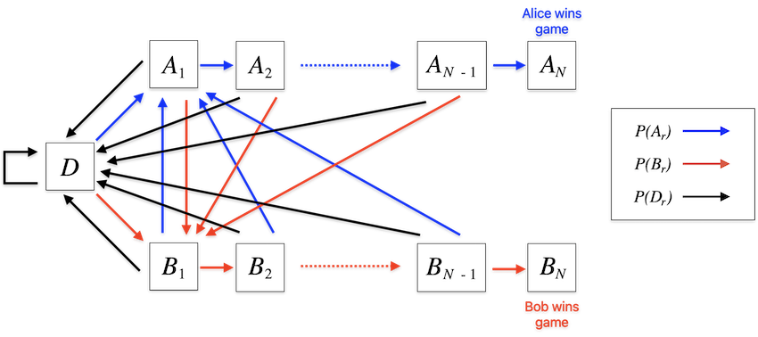
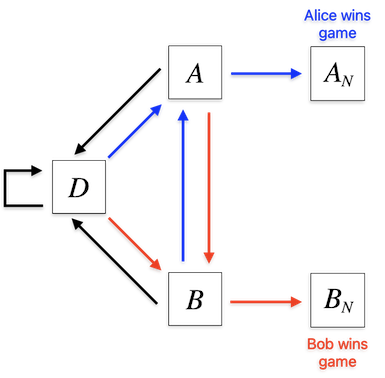

# February 2024 Ponder This Challenge
The [February challenge](https://research.ibm.com/haifa/ponderthis/challenges/February2024.html) concerns the probabilities of outcomes of a particular dice game

## Challenges
Using 6 specified dice, Alice and Bob play a game where for each round all dice are rolled and the values are summed. Alice wins the round if the sum is prime, and Bob wins if the sum is a non-prime and even, with all other sums resulting in a draw. Either player wins the game once they win $N$ consecutive rounds. The challenge asks for the probability that Alice wins the game where $N = 13$.

The bonus challenge asks for the probability that Alice wins the game where Bob wins the round if the sum of the dice is a non-prime odd number and $N = 300$.

## Solution

The solution is implemented in Python 3.

Usage:

	python feb2024.py

The solution will calculate and output the probabilities of Alice winning the game for both the main and bonus challenges.

## Discussion

I learned a lot on this one.

Calculating the relative probabilities that a round ends in a win for Alice $P(A_r)$, a win for Bob $P(B_r)$ or a draw $P(D_r)$ is simple enough (assuming that all dice are fair). All possible results of rolling the dice can be examined to determine the probabilities of each outcome. The approximate values are:

| Challenge | $P(A_r)$  | $P(B_r)$  | $P(D_r)$ |
|-----------|-----------|-----------|----------|
| Main      | $0.248$   | $0.5$     | $0.252$  |
| Bonus     | $0.248$   | $0.252$   | $0.5$    |

Calculating the probabilities for outcomes of the game rather than a round is less straightforward.

### Modeling game probabilities as a Markov chain 

The space of all games can be modelled statistically as a [Markov chain](https://en.wikipedia.org/wiki/Markov_chain) with relatively few states based on the number of previous consecutive rounds won by both players: a state with zero consecutive wins for both players (the previous round was a draw), and states where each player has had $1$ to $N$ consecutive wins, for a total of $2N + 1$ states.

Starting from a state with a value of $1$ in the $D$ state, representing the start of all possible games, the proportion of games in each state can be iteratively updated according to the transition probabilities of the system. The eventual equilibrium of the system must settle on all games distributed between the $A_N$ and $B_N$ win states according to their relative probabilities, although it will require an infinite number of steps to reach this. For the main challenge, the final equilibrium can be approximated by allowing the system to advance until the sum of values remaining outside the $A_N$ and $B_N$ states drops below some threshold $\epsilon$, then determining the ratio of values accumulated in the $A_N$ and $B_N$ states to give the probability that Alice wins the game.

### Markov chain simplification and approximation of the final equilibrium

While the model for the main challenge can reach the final equilibrium within $\epsilon$ quite quickly, the bonus challenge presents some difficulties for this approach. Because of the large $N$ and the high per-round probability of a draw, values accumulate in the end states too slowly to reach a result in reasonable time.

To determine the probabilities of Alice or Bob winning the game, it's not necessary to advance the model to near-completion. Instead, the final equilibrium can be estimated after advancing the model until it reaches a relatively stable configuration. This is made easier by simplifying the model to five states rather than $2N + 1$ states: A draw state $D$, an Alice game win state $A_N$, a Bob game win state $B_N$, and states $A$ and $B$ where Alice or Bob have won between $1$ and $N - 1$ consecutive rounds.

The transition probabilities between states are more complicated, but are simple enough to calculate.

| Transition    | Probability                                  |
|---------------|----------------------------------------------|
| $D \to D$     | $$P(D_r)$$                                   |
| $D \to A$     | $$P(A_r)$$                                   |
| $D \to B$     | $$P(B_r)$$                                   |
| $A \to D$     | $$\sum_{i=0}^{N-2} P(A_r)^{i} \cdot P(D_r)$$ |
| $A \to B$     | $$\sum_{i=0}^{N-2} P(A_r)^{i} \cdot P(B_r)$$ |
| $A \to A_N$   | $$P(A_r)^{N-1}$$                             |
| $B \to D$     | $$\sum_{i=0}^{N-2} P(B_r)^{i} \cdot P(D_r)$$ |
| $B \to A$     | $$\sum_{i=0}^{N-2} P(B_r)^{i} \cdot P(A_r)$$ |
| $B \to B_N$   | $$P(B_r)^{N-1}$$                             |

Once the simplified model is constructed, it can be run forward some number of steps until the relative values in the draw and consecutive win states have stabilized. The final equilibrium of the system can then be estimated based on the values that have already accumulated in the game end states, the ratio of values in the consecutive win states, and the probabilities of transition to the game end states.

After the model has been run for enough steps to reach a stable ratio between the values in the $D$, $A$ and $B$ states, take the values in each state as $D'$, $A'$, $B'$, $(A_N)'$ and $(B_N)'$. The probability that Alice wins the game is approximately:

$$ P(A_{win}) \approx (A_N)' + \dfrac{A' \cdot P(A_r)^{N-1} \cdot (1 - (A_N)' - (B_N)')}{A' \cdot P(A_r)^{N-1} + B' \cdot P(B_r)^{N-1}}$$
