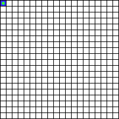
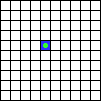

# June 2025 Ponder This Challenge
The [June challenge](https://research.ibm.com/haifa/ponderthis/challenges/June2025.html) involves a board game where a frog traverses the board, modifying the colors of board cells with each move.

## Challenges

The challenge specifies a game played on an $N \times N$ board, where the player controls the movements of a frog piece, starting at some position. Each cell on the board can be colored *white*, *blue* or *red*. The board starts the game with all cells white, except for the starting cell of the frog.

At each step, the frog may move horizontally, vertically or diagonally by one cell in any direction. Move directions are denoted by the letters "A" (east) clockwise through "H" (north-east). The frog can only move to a cell if:

1. The destination cell is **white**.
2. The next cell after the destination cell in the same direction as the frog's movement is **not blue**. If the next cell would be out of the bounds of the board this rule is ignored.

When the frog moves to a cell:

1. The destination cell becomes **blue**
2. The next cell after the destination cell in the same direction as the frog's movement becomes **red**. If the next cell would be out of the bounds of the board this rule is ignored.

The goal of the game is for the frog to color all white cells on the board red or blue.

The main challenge asks for a sequence of moves that fully colors a $20 \times 20$ board where the frog starts at position $(0,0)$.

The bonus challenge asks for a sequence of moves that fully colors a $10 \times 10$ board where the frog starts at position $(4,4)$.

## Solution

The solution is implemented in Rust

Usage:

```console
$ cargo run --release -- [OPTIONS]
```
or
```console
$ cargo build --release
$ ./target/release/jun2025 [OPTIONS]
```
```
Options:
  -b, --bonus       Calculate bonus challenge solution
  -p, --pattern     Use heuristic patterns in solution
  -g, --gif <PATH>  Export solution as an animated GIF
  -h, --help        Print help
```

Examples:

Find a solution to the main challenge:

```console
$ ./target/release/jun2025
```

Find a solution to the bonus challenge and export the move sequence as an animated GIF:

```console
$ ./target/release/jun2025 --bonus --gif bonus.gif
```

Find a solution to the main challenge using a repeating pattern of moves and export the move sequence as an animated GIF:

```console
$ ./target/release/jun2025 --pattern --gif spiral.gif
```

## Discussion

While tree-spanning search algorithms or random walks are able to find sequences of moves to color the board for small $N$, the search space expands rapidly as $N$ increases. There appear to be many paths that can fully color the board at any size, but they are increasingly difficult to find as the search space grows. Fully searching the possible distinct paths for a $10 \times 10$ or $20 \times 20$ board is not feasible to find examples which color the board.

There are at least two approaches which are able to find move sequences which color the board in reasonable time.

### Coloring subsections in sequence

One approach is to search for arbitrary paths that fully color a small region of the board and result in the frog positioned at the region's border. By repeatedly producing "tiles" of colored sub-regions, paths to color the full board can be reached. Limiting the tile size (e.g. to $5 \times 5$ regions) allows searches for valid sub-paths to be completed in reasonable time.

#### Examples



 

### Repeating move patterns

It's possible to find repeatable sequences of moves that can be applied to fully color sub-sections of the board. These can be chained together to color the either the entirety of the board or a large enough area that moves to color the remainder can be found with a search. One such sequence looks like the following:

 

Other usable repeating sequences may also exist, although this solution only makes use of the above.

For the main challenge, a spiral pattern composed from a repeatable move sequences is one way to fully color the entire board. 


For the bonus challenge, it's straightforward to use a search to find paths that fully color a $4 \times 4$ center region of the board with the frog starting from $(4,4)$ and ending in a position compatible with the start of an outward spiral that will color the remainder of the board.


